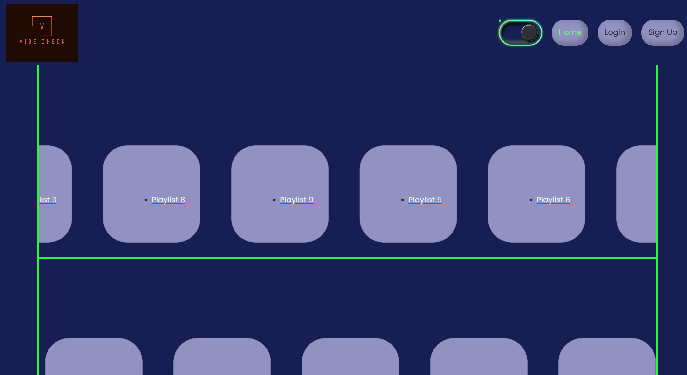
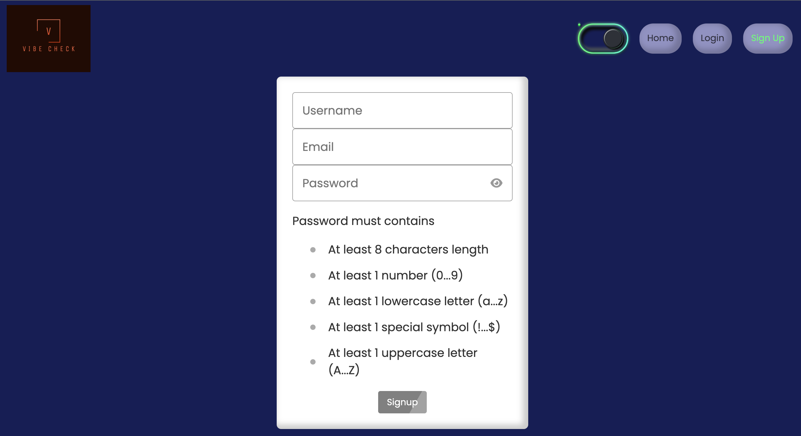
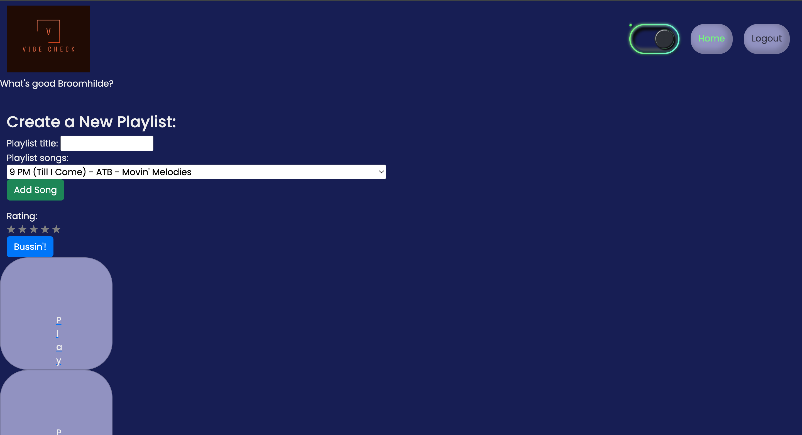
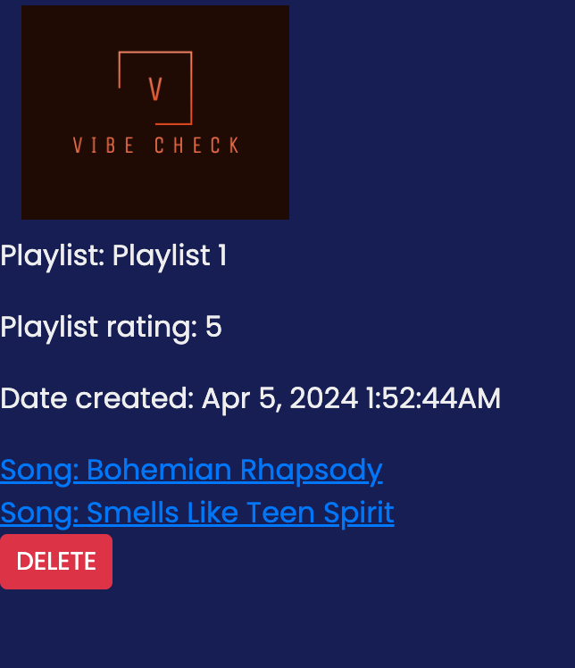
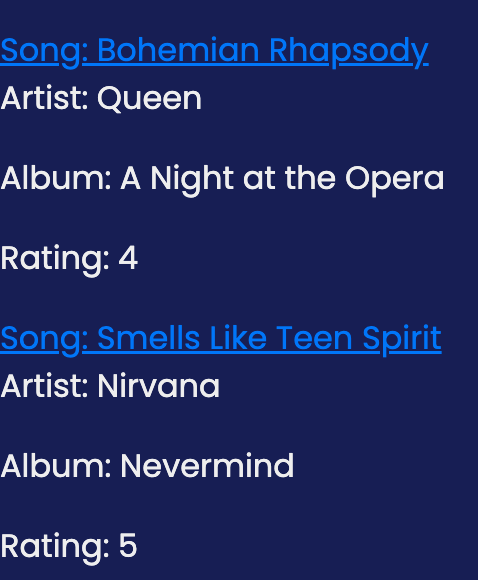

# Vibe_Check

Playlist storage site

## Description

Vibe Check is a fullstack web application built with Node.js, Express, MySQL, and Handlebars that allows users to create and save custom playlists from a provided list of songs. User authentication is required to access and manage playlists.

## Table of Contents

- [Introduction](#introduction)
- [Problem](#problem)
- [Solution](#solution)
- [Contributors](#contributors)
- [Credits](#credits)
- [Contact](#contact)
- [License](#license)

## Introduction

Our app is a music playlist and rating website that allows a user to create an account and then create playlists from a list of popular music.

## Problem

We wanted to make a site that lets us create playlists, share them and get introduced to other user’s playlists, because as an avid music connoisseur, we want to expand our exposure to new music so that we can listen to new music that is similar to our current tastes but are as yet unknown to us.

## Solution

We created an application that allows for playlist creation and rating, by users that are logged in. Future functionality should include the ability to edit a created playlist, coneection to an outside API for an expansive song list, and a music player.

Here are some screeenshots of our application:

## Deployed Application

The project is deployed at the following URL: [Vibe Check](https://vibe-check-student-app-d25fe2fb6a44.herokuapp.com/)

## Contributors

Aaron Ho, Joshua Jacob, and Keegan Royal-Eisenberg worked on this project together.

We used phind.com to help with debugging.

## Credits

We used the following guides in building this application:

[Dark Neon Toggle Switch code](https://github.com/frontendcharm/Mini-Projects/tree/abf022a7d8535e046f929df1fd7cb9cf6e770799/FORM%20AND%20INPUTS/Dark%20Neon%20Toggle%20Switch)

[Password Validator code](https://www.codingayush.com/2023/05/password-validation-using-html-css.html)

[Carousel code](https://github.com/Dinil-Thilakarathne/ui-components/tree/main/carousel)

[NetNinja Responsive Design tutorials on Youtube (burgernav)](https://www.youtube.com/watch?v=3tLb3i7GB38&list=PL4cUxeGkcC9g9Vh9MAA-XKnfJsWZnPZFw&ab_channel=NetNinja)

We also used ChatGPT to create dummy data.

## Contact

You can contact us here if you have questions:

Github: [Joshua Jacob](https://github,com/joshjac16)

Email: [josh11jac16@gmial.com](mailto:josh11jac16@gmail.com)

Github: [AaronH-o](https://github.com/AaronH-o)

Email: [bicecreamaar@gmail.com](mailto:bicecreamaar@gmail.com)

Github: [ktetsuyama](https://github.com/ktetsuyama)

Email: [kroyal.eisenberg@gmail.com](mailto:kroyal.eisenberg@gmail.com)

## License

This project is covered under the 

Learn more about this license [here](https://creativecommons.org/licenses/by-sa/4.0/).
